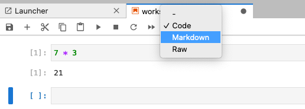

::::::::::::::::::::::::::::::::::::::: objectives

- Launch JupyterLab and create a new Jupyter Notebook.
- Navigate the JupyterLab interface, including file browsing, cell creation, and cell execution, with confidence.
- Write and execute Python code in a Jupyter Notebook cell, observing the output and modifying code as needed.
- Save a Jupyter Notebook as an .ipynb file and verify the file’s location in the directory within the session.

::::::::::::::::::::::::::::::::::::::::::::::::::

:::::::::::::::::::::::::::::::::::::::: questions

- How can I identify and use key features of JupyterLab to create and manage a Python notebook?
- How do I run Python code in JupyterLab, and how can I see and interpret the results?
::::::::::::::::::::::::::::::::::::::::::::::::::

This episode is a modified copy of the [Getting Started episode](https://librarycarpentry.github.io/lc-python-intro/getting-started.html) of the Python Intro for Libraries lesson.

## Why Python?

Python is a popular programming language for tasks such as data collection, cleaning, and analysis. Python can help you to create reproducible workflows to accomplish repetitive tasks more efficiently.

## What is Python?

Python is a general purpose programming language that supports rapid development of data analytics
applications.  The word "Python" is used to refer to both, the programming language and the tool
that executes the scripts written in Python language.

Its main advantages are:

- Free
- Open-source
- Available on all major platforms (macOS, Linux, Windows)
- Supported by Python Software Foundation
- Supports multiple programming paradigms
- Has large community
- Rich ecosystem of third-party packages

*So, why do you need Python for data analysis?*

- **Easy to learn:**
  Python is easier to learn than other programming languages. This is important because lower barriers
  mean it is easier for new members of the community to get up to speed.

- **Reproducibility:**
  Reproducibility is the ability to obtain the same results using the same dataset(s) and analysis.
  
  Data analysis written as a Python script can be reproduced on any platform.  Moreover, if you
  collect more or correct existing data, you can quickly re-run your analysis!
  
  An increasing number of journals and funding agencies expect analyses to be reproducible,
  so knowing Python will give you an edge with these requirements.

- **Versatility:**
  Python is a versatile language that integrates with many existing applications to enable something
  completely amazing.  For example, one can use Python to generate manuscripts, so that if you need to
  update your data, analysis procedure, or change something else, you can quickly regenerate all the
  figures and your manuscript will be updated automatically.
  
  Python can read text files, connect to databases, and many other data formats, on your computer or
  on the web.

- **Interdisciplinary and extensible:**
  Python provides a framework that allows anyone to combine approaches from different research
  (but not only) disciplines to best suit your analysis needs.

- **Python has a large and welcoming community:**
  Thousands of people use Python daily. Many of them are willing to help you through mailing lists and
  websites, such as [Stack Overflow][stack-overflow]  and [Anaconda community
  portal][anaconda-community].

- **Free and Open-Source Software (FOSS)... and Cross-Platform:**
  We know we have already said that but it is worth repeating.
  
## Research Project: Best Practices

It is a good idea to keep a set of related data, analyses, and text in a single folder.
All scripts and text files within this folder can then use relative paths to the data files.
Working this way makes it a lot easier to move around your project and share it with others.

### Organizing your working directory

Using a consistent folder structure across your projects will help you keep things organized,
and will also make it easy to find/file things in the future. This can be especially helpful
when you have multiple projects. In general, you may wish to create separate directories for
your scripts, data, and documents.

- **`data/`**: Use this folder to store your raw data. For the sake of transparency and provenance,
  you should always keep a copy of your **raw data**. If you need to cleanup data, do it
  programmatically (*i.e.* with scripts) and make sure to separate cleaned up data from the raw data.
  For example, you can store raw data in files `./data/raw/` and clean data in `./data/clean/`.

- **`documents/`**: Use this folder to store outlines, drafts, and other text.

- **`code/`**: Use this folder to store your (Python) scripts for data cleaning, analysis, and
  plotting that you use in this particular project.

You may need to create additional directories depending on your project needs, but these should form
the backbone of your project's directory. For this workshop, we will need a `data/` folder to store
our raw data, and we will later create a `data_output/` folder when we learn how to export data as
CSV files.


## Use JupyterLab to edit and run Python code.
  
For having a common platform to run our Python code, we'll use the [JupyterHub instance provided by LSIT](https://carpentryworkshop.lsit.ucsb.edu/). If you want to install Python on your machine, [the setup instructions](../learners/setup.md) for details on how to install Python, JupyterLab, and the necessary packages using Pixi.

### Getting started with JupyterLab
To run Python, we are going to use Jupyter Notebooks via [JupyterLab][jupyterlab]. Jupyter notebooks are common tools for data science and visualization, and serve as a convenient environment for running Python code interactively where we can view and share the results of our Python code.

:::::::::::::::::::::::::::::::::::::::::  callout
### Alternatives to Juypter
There are other ways of editing, managing, and running Python code. Software developers often use an integrated development environment (IDE) like [PyCharm](https://www.jetbrains.com/pycharm/), [Spyder][spyder] or [Visual Studio Code (VS Code)](https://code.visualstudio.com/), to create and edit Python scripts. Others use text editors like Vim or Emacs to hand-code Python. After editing and saving Python scripts you can execute those programs within an IDE or directly on the command line.
::::::::::::::::::::::::::::::::::::::::::::::::::

Jupyter notebooks let us execute and view the results of our Python code immediately within the notebook. JupyterLab has several other handy features:

- You can easily type, edit, and copy and paste blocks of code.
- It allows you to annotate your code with links, different sized text, bullets, etc.
  to make it more accessible to you and your collaborators.
- It allows you to display figures next to the code 
  to better explore your data and visualize the results of your analysis.
- Each notebook contains one or more cells that contain code, text, or images.


## The JupyterLab Interface

Launching JupyterLab opens a new tab or window in your preferred web browser. While JupyterLab enables you to run code from your browser, it does not require you to be online. If you take a look at the URL in your browser address bar, you should see that the environment is located at your localhost, meaning it is running from your computer: `http://localhost:8888/lab`.

When you first open JupyterLab you will see two main panels. In the left sidebar is your file browser. You should see a folder in the file browser named `data` that contains all of our data. 

### Creating a Juypter Notebook

To the right you will see a `Launcher` tab. Here we have options to launch a Python 3 notebook, a Terminal (where we can use shell commands), text files, and other items. For now, we want to launch a new Python 3 notebook, so click once on the `Python 3 (ipykernel)` button underneath the Notebook header. You can also create a new notebook by selecting *New -> Notebook* from the *File* menu in the Menu Bar.

{alt='screenshot of the JupyterLab for launching notebook'}

When you start a new Notebook you should see a new tab labeled `Untitled.ipynb`. You will also see this file listed in the file browser to the left. Right-click on the `Untitled.ipynb` file in the file browser and choose `Rename` from the dropdown options. Let's call the notebook file, `workshop.ipynb`.


:::::::::::::::::::::::::::::::::::::::::  callout

## JupyterLab? What about Jupyter notebooks? Python notebooks? IPython?

JupyterLab is the [next stage in the evolution of the Jupyter Notebook](https://jupyterlab.readthedocs.io/en/stable/getting_started/overview.html#overview).
If you have prior experience working with Jupyter notebooks, then you will have a good idea of how to work with JupyterLab. Jupyter was created as a spinoff of IPython in 2014, and includes interactive computing support for languages other than just Python, including R and Julia. While you'll still see some references to Python and IPython notebooks, IPython notebooks are officially deprecated in favor of Jupyter notebooks.

::::::::::::::::::::::::::::::::::::::::::::::::::

We will share more features of the JupyterLab environment as we advance through the lesson, but for now let's turn to how to run Python code.

### Running Python code 

Jupyter allows you to add code and formatted text in different types of blocks called cells. By default, each new cell in a Jupyter Notebook will be a "code cell" that allows you to input and run Python code. Let's start by having Python do some arithmetic for us. 

In the first cell type 7 * 3, and then press the <kbd>Shift</kbd>\+<kbd>Return</kbd> keys together to execute the contents of the cell. (You can also run a cell by making sure your cursor is in the cell and choosing `Run > Run Selected Cells` or selecting the "Play" icon (the sideways triangle) at the top of the noteboook.)

```python
7 * 3
```

You should see the output appear immediately below the cell, and Jupyter will also create a new code cell for you. 

```python
21
```

If you move your cursor back to the first cell, just after the `7 * 3` code, and hit the <kbd>Return</kbd> key (without shift), you should see a new line in the cell where you can add more Python code. Let's add another calculation to the same cell:

```python
7 * 3
2 +1
```

While Python runs both calculations Juypter will only display the output from the last line of code in a specific cell, unless you tell it to do otherwise.

```python
3
```

### Editing the notebook

You can use the icons at the top of your notebook to edit the cells in your Notebook:

- The `+` icon adds a new cell below the selected cell.
- The scissors icon will delete the current cell. 

You can move cells around in your notebook by hovering over the left-hand margin of a cell until your cursor changes into a four-pointed arrow, and then dragging and dropping the cell where you want it.

:::::::::::::::::::::::::::::::::::::::::  callout
### Markdown
::::::::::::::::::::::::::::::::::::: instructor

Instructors: Since the lesson is focused on Python we don't include any Markdown examples here. If you want to teach Markdown, note that it will slow down the lesson.

:::::::::::::::::::::::::::::::::::::::::::::::::

You can add text to a Juypter notebook by selecting a cell, and changing the dropdown above the notebook from `Code` to `Markdown`. Markdown is a lightweight language for formatting text. This feature allows you to annotate your code, add headers, and write documentation to help explain the code. While we won't cover Markdown in this lesson, there are many helpful online guides out there:
- [Markdown for Jupyter Cheatsheet (IBM)](https://www.ibm.com/docs/en/watson-studio-local/1.2.3?topic=notebooks-markdown-jupyter-cheatsheet)
- [Markdown Guide (Matt Cone)](https://www.markdownguide.org/)

{alt='screenshot of the Jupyter notebook dropdown to change a cell to Markdown'}

You can also use "hotkeys"" to change Jupyter cells from Code to Markdown and back:

- Click on the code cell that you want to convert to a Markdown cell.
- Press the <kbd>Esc</kbd> key to enter command mode.
- Press the <kbd>M</kbd> key to convert the cell to Markdown.
- Press the <kbd>y</kbd> key to convert the cell back to Code.
::::::::::::::::::::::::::::::::::::::::::::::::::

[spyder]: https://www.spyder-ide.org/
[jupyterlab]: https://jupyterlab.readthedocs.io/en/stable/

:::::::::::::::::::::::::::::::::::::::: keypoints

- You can launch JupyterLab from the command line or from Anaconda Navigator.
- You can use a JupyterLab notebook to edit and run Python.
- Notebooks can include both code and markdown (text) cells.

::::::::::::::::::::::::::::::::::::::::::::::::::
